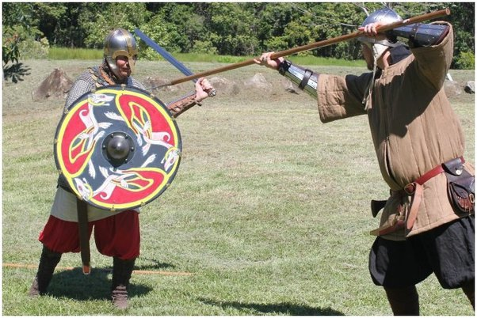

# DSPy-Guardrails: Building self-refined guardrails via DSPy

The step-by-step tutorial is in [dspy_guardrails.ipynb](dspy_guardrails.ipynb). And we also provide source file of [slide](dg-slide.pptx) and [poster](dg-poster.pptx).

- Welcome to use it to test your redteam method. I would be all in this program to see whether the spear or the shield is better.

- For any question, feel free to reach me at boxiyu@link.cuhk.edu.cn.
